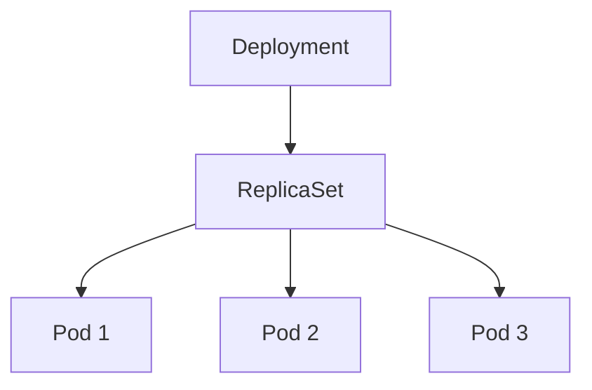

---

# Kubernetes Core Concepts — Reference Notes

##  Fundamental Mental Model

Kubernetes is a **Desired State Reconciliation System**. You declare how the system **SHOULD** look, and Kubernetes continuously works to enforce that state.

**The Control Loop:**
`Desired State` → `Controller` → `Actual State` → `Reconcile`

This controller pattern is the backbone of Kubernetes architecture.

---

## Pods — Disposable Compute Units

A **Pod** is the smallest deployable unit in Kubernetes. It represents a single instance of a running process in your cluster.

### Typically contains:

* **Containers:** One primary container (sometimes "sidecars").
* **Networking:** Shared IP address and port space.
* **Storage:** Shared volumes for the containers.

### Key Properties:

* **Ephemeral:** Temporary by design.
* **Replaceable:** If a Pod dies, it is replaced, not "repaired."
* **Passive:** Not self-healing on its own; it requires a controller.

> [!CAUTION]
> **Engineering Rule:** Never architect a system that depends on a single Pod surviving. Pods can die due to Node failure, OOM (Out of Memory) kills, or rescheduling.

---

##  Deployments — Production-Grade Workload Managers

A **Deployment** provides declarative updates for Pods. Instead of managing Pods directly, you define a **Desired Replica Count**.

```bash
kubectl create deployment my-app --image=nginx --replicas=3

```

**Kubernetes will automatically:**

1. Create the necessary Pods.
2. Monitor their health.
3. Replace failed Pods to maintain the replica count.

### The Controller Pattern in Action

Controllers continuously perform three steps:

1. **Observe:** Look at the current cluster state.
2. **Compare:** Check against the desired state (e.g., "I need 3 replicas").
3. **Act:** If only 2 are running, the controller creates a new one.

---

##  Object Hierarchy

Understanding the relationship between objects is critical for debugging:

| Object | Responsibility |
| --- | --- |
| **Deployment** | Handles updates, rollbacks, and strategy. |
| **ReplicaSet** | Ensures the specific number of Pods are running. |
| **Pod** | The actual execution of the container. |



*Note: You will rarely interact with ReplicaSets directly; the Deployment manages them for you.*

---

##  Operations & Scaling

###  Dynamic Scaling

To scale your application horizontally:

```bash
# Scale Up
kubectl scale deployment my-app --replicas=5

# Scale Down
kubectl scale deployment my-app --replicas=2

```

###  Rolling Updates (Zero-Downtime)

Update your application version without dropping traffic:

```bash
# Trigger Update
kubectl set image deployment/my-app nginx=nginx:1.25

# Monitor Progress
kubectl rollout status deployment/my-app

# Undo if things go wrong
kubectl rollout undo deployment/my-app

```

---

## Labels and Selectors

Labels are key-value pairs attached to objects (Metadata). They are the "glue" that links different Kubernetes components together.

**Example Labels:**

* `app: my-app`
* `env: prod`
* `tier: backend`

**Why they matter:**

* **Service Discovery:** How Services find Pods to send traffic to.
* **Organization:** Grouping resources for bulk actions.
* **Security:** Applying policies to specific application tiers.

```bash
# View labels on your pods
kubectl get pods --show-labels

```

---

##  Cleanup

When a Deployment is deleted, Kubernetes performs a **cascade deletion**, removing the associated ReplicaSet and Pods automatically.

```bash
kubectl delete deployment my-app

```

---

## Summary & Best Practices

### Critical Takeaways

*  **Pods are ephemeral** — never treat them as pets.
*  **Deployments maintain state** — they are your primary interface for apps.
*  **Self-healing** — infrastructure should fix itself without manual intervention.
*  **Rolling updates** — standard for modern production deployments.

### Pro-Tip: Move to Declarative YAML

While `kubectl create` is great for learning, **Production systems use YAML.** **Why?**

1. **Version Control:** Track changes in Git.
2. **Reproducibility:** Spin up identical environments easily.
3. **Auditing:** Know exactly who changed what and when.

---


